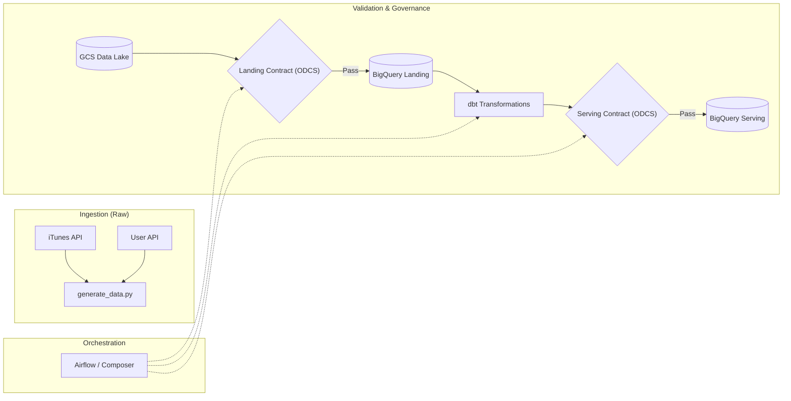
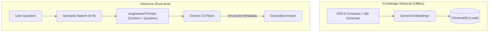

# 🎵 DefTunes: Data Engineering & AI Discoverability Capstone

[](https://chugh-gourav.github.io/deftunes_data_engineering_rag_capstone/)
[](odcs_contracts/landing_datacontract.yaml)

---

## 📖 The Story: Helping Teams Find Data Faster

Every data-driven organization faces a silent bottleneck. For the **Business Analytics and Data Science communities**, getting quick access to technical metadata is the difference between a same-day business decision and a week-long research ticket.

When a Data Scientist or BA has to manually hunt for column definitions, quality rules, or SLAs across different contracts and files, it slows down the entire business.

**DefTunes AI** is a RAG assistant designed to solve this. It turns technical documentation into a conversation, delivering sub-2s answers to the people who need them most.

---

## 🏗️ How It Works

### 1. Unified Data Pipeline
Data moves from the iTunes and User APIs through a governed pipeline where validation is baked into every step.



### 2. AI Discovery Engine
We use semantic search to ensure the model responds only with verified facts.



---

## 📈 Unit Economics (Directional)

To build a realistic business case, we factor in both the AI's cost and the time a person spends verifying the answer.

### Key Assumptions
- **London Market Rate:** £65 / hour (Mid-Senior Data Engineer fully-loaded cost).
- **Manual Task Time:** 15 minutes of searching and context switching.

### Cost Comparison (Per Task)

| Scenario | AI API Cost | Human Verification | Total Task Cost | Potential Gain |
| :--- | :--- | :--- | :--- | :--- |
| **Manual Search** | £0.00 | 15 mins (£16.25) | **£16.25** | - |
| **Basic RAG (Current)** | $0.0003 | 5 mins (£5.41) | **~£5.42** | **3x Saving** |
| **Advanced AI (Future)** | $0.05 | 1 min (£1.08) | **~£1.14** | **14x Saving** |

---

## 🧠 Scaling the System: 22 vs. 22,000 Chunks

As the knowledge base grows 1,000x, we shift our strategy to maintain accuracy.

**1. Stable Costs**
RAG decouples data size from AI cost. Even at 22,000 chunks, we only retrieve the top **k=5** matches, so the AI token cost stays fixed at **~$0.0003/query**.

**2. Managing Noise**
To keep accuracy high at a larger scale, we would move toward:
- **Agentic Workflows:** Using the AI to "judge" its own answers before showing them to humans.
- **GraphRAG:** Linking data entities (like Project → Owner → Contract) into a "map" so the search follows logical relationships instead of just keywords.

---

## 🔗 Reference Case Studies & Links
Industry leaders are using similar strategies to handle internal documentation and compliance:

*   **[KPMG Adoption Case Study](https://www.techuk.org/resource/ai-adoption-case-study-kpmg-s-ava-gen-ai-tool-creates-useable-outputs-improves-efficiences-and-reduces-risk.html):** How AI tools improve efficiencies and reduce risk in professional services.
*   **[Nasdaq / Progress RAG Platform](https://www.nasdaq.com/press-release/progress-software-unveils-breakthrough-saas-rag-platform-designed-make-trustworthy):** Breakthrough in building trustworthy AI for high-compliance environments.
*   **[Autodesk Assistant Platform](https://aws.amazon.com/blogs/machine-learning/autodesk-assistant-building-an-agentic-platform-on-amazon-bedrock/):** Moving from basic search to an assistant that navigates complex technical data.

---

## 🚀 Future Ideas
As we move toward a production-ready tool, we should explore:
1.  **Automated Verification:** Can we use a "judge" model to minimize the time a person sticks around to check the answer?
2.  **Broader Data Silos:** How do we link this to Jira tickets and Slack history to capture "tribal knowledge" that isn't in the official contracts?
3.  **Actionable AI:** Can the assistant help draft new Data Contracts or suggest schema changes based on user questions?

---

## 📂 Project Structure
```
deftunes_capstone/
├── odcs_contracts/      # ODCS v3.1 Data Contracts  ← Source of Truth
├── rag_app/             # Streamlit Chat UI + ChromaDB (Skyscanner Theme)
└── dbt_modeling/        # Core Business Logic (Fact / Dim / Views)
```

## 👤 Author: Gourav Chugh
**AI/Data Product Manager**  
[GitHub Portfolio](https://github.com/Chugh-Gourav)

---
*Built for the AI Product Management Capstone — DefTunes Project.*
