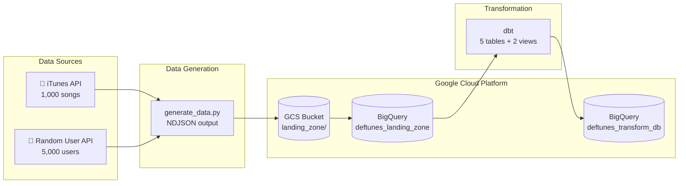
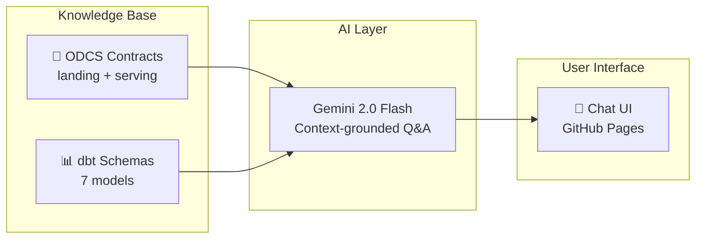

# 🎵 DefTunes: AI Discoverability and Data Pipeline

An end-to-end **GCP data pipeline** and **AI-powered data discoverability** application for a simulated music streaming platform. Built to demonstrate how a **Data/AI Product Manager** can design, build, and document data products using modern cloud-native tools.

> **Live Demo:** [Try the AI Discoverability App →](https://chugh-gourav.github.io/deftunes_data_engineering_rag_capstone/)  
> Enter your Gemini API key and ask questions about the DefTunes data ecosystem.

---

## 🏗️ Architecture

### Data Pipeline


### RAG Discoverability App


---

## 📊 Data Model

| Layer | Table | Rows | Description |
|-------|-------|------|-------------|
| **Landing** | `raw_users` | 5,000 | User profiles with geography |
| **Landing** | `raw_songs` | 1,000 | Song catalog from iTunes API |
| **Landing** | `raw_sessions` | 100,000 | Listening events (30-day window) |
| **Landing** | `raw_user_feedback` | 50,000 | Likes, dislikes, skips, playlist adds |
| **Serving** | `fact_session` | 100,000 | Cleaned session facts |
| **Serving** | `fact_feedback` | 50,000 | Cleaned interaction facts |
| **Serving** | `dim_artists` | 552 | Deduplicated artist dimension |
| **Serving** | `dim_songs` | 1,000 | Song dimension with artist linkage |
| **Serving** | `dim_users` | 5,000 | User dimension with geography |
| **BI Views** | `interactions_per_artist_vw` | - | Likes/dislikes aggregated by artist |
| **BI Views** | `interactions_per_country_vw` | - | Interactions aggregated by country |

---

## 🛠️ Tech Stack

| Component | Technology |
|-----------|------------|
| **Cloud** | Google Cloud Platform (GCS, BigQuery) |
| **Orchestration** | Apache Airflow (Cloud Composer) |
| **Transformation** | dbt (dbt-bigquery adapter) |
| **Data Contracts** | ODCS v3.1.0 |
| **AI / LLM** | Google Gemini 2.0 Flash |
| **Embeddings** | Gemini Embedding 001 |
| **Vector Store** | ChromaDB (local Streamlit version) |
| **Frontend** | Static HTML/JS (GitHub Pages) |
| **Data Format** | NDJSON (Newline Delimited JSON) |

---

## 📁 Project Structure

```
deftunes_data_engineering_rag_capstone/
├── README.md
├── requirements.txt
│
├── data_generator/             # Phase 1: Data Generation
│   ├── generate_data.py        # Fetch songs (iTunes API) + simulate users/sessions/feedback
│   ├── load_to_bq.py           # Load NDJSON from GCS → BigQuery landing zone
│   └── test_spotify.py         # Spotify API evaluation (documented pivot)
│
├── dags/                       # Phase 2: Orchestration
│   └── gcp_deftunes_pipeline.py  # Airflow DAG for production ingestion
│
├── dbt_modeling/               # Phase 3: Transformation
│   ├── dbt_project.yml
│   └── models/
│       ├── serving_layer/      # Fact + dimension tables
│       └── bi_views/           # Aggregated interaction views
│
├── odcs_contracts/             # Phase 4: Data Contracts
│   ├── landing_datacontract.yaml
│   └── serving_datacontract.yaml
│
├── rag_app/                    # Phase 5A: RAG App (Streamlit + ChromaDB)
│   ├── app.py
│   ├── ingest.py
│   └── requirements.txt
│
└── docs/                       # Phase 5B: RAG App (GitHub Pages)
    └── index.html              # Static AI chat — no backend required
```

---

## 🚀 Quick Start

### 1. Generate Data
```bash
cd data_generator
pip install requests
python generate_data.py
```

### 2. Upload to GCS & Load to BigQuery
```bash
# Upload NDJSON files to GCS (requires gcloud auth)
gsutil cp *.json gs://ai-data-product-work-data-lake/landing_zone/

# Load into BigQuery
pip install google-cloud-bigquery
python load_to_bq.py
```

### 3. Run dbt Transformations
```bash
cd ../dbt_modeling
pip install dbt-bigquery
dbt run   # Build 7 models
dbt test  # Run 6 data quality tests
```

### 4. Launch RAG App (Local)
```bash
cd ../rag_app
pip install -r requirements.txt
export GOOGLE_API_KEY="your-gemini-api-key"
python ingest.py          # Build ChromaDB vector store
streamlit run app.py      # Launch at localhost:8501
```

### 5. Launch RAG App (GitHub Pages)
Simply open `docs/index.html` in a browser, or visit the [live demo](https://chugh-gourav.github.io/deftunes_data_engineering_rag_capstone/).

---

## 📋 Data Contracts (ODCS v3.1)

This project uses **Open Data Contract Standard** to formally define data ownership, schema, quality rules, and SLAs:

- **[Landing Contract](odcs_contracts/landing_datacontract.yaml)** — Defines raw data tables, field types, and freshness guarantees
- **[Serving Contract](odcs_contracts/serving_datacontract.yaml)** — Defines transformed models, BI views, and quality validation rules

---

## 👤 Author

**Gourav Chugh**  
[GitHub](https://github.com/Chugh-Gourav) · AI Product Management
