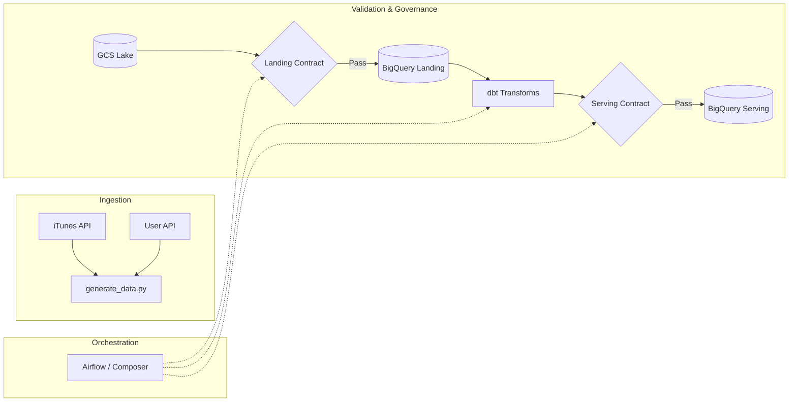
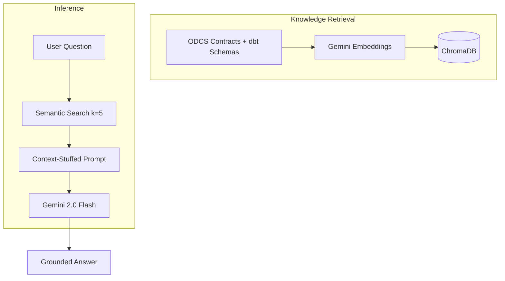

# 🎵 DefTunes: Data Engineering & AI Discoverability Capstone

[](https://chugh-gourav.github.io/deftunes_data_engineering_rag_capstone/)
[](odcs_contracts/landing_datacontract.yaml)

---

## The Story

Every data team has the same problem.  An analyst pings you on Slack: *"Hey, which table has the user's country code?"*  A product manager opens a ticket: *"What quality rules protect our feedback data?"*  A new engineer spends 45 minutes grepping through YAML files to find an SLA definition.

These questions aren't hard — the answers **do** exist, scattered across ODCS contracts, dbt schema files, and wiki pages.  The real cost is the interruption and the time it takes a human to locate the answer.  Multiply that across a growing team, and you're burning thousands of dollars a month on something an AI can do for fractions of a cent.

**DefTunes AI** is a Retrieval-Augmented Generation (RAG) assistant that turns this problem into a solved one.  It ingests our formal data contracts and dbt metadata, stores them in a local vector database, and uses Gemini 2.0 Flash to answer questions — grounded 100 % in the source of truth.

---

## How It Works

### 1. Data & Orchestration Pipeline

Raw data flows from the iTunes and User APIs through a governed pipeline with validation at every stage.



### 2. AI Discovery Engine (RAG)

When a user asks a question, we search the vector database for the 5 most relevant chunks, inject them into a Gemini prompt, and return a grounded answer.



---

## Unit Economics — Worked Example

One of the most important things a Product Manager should validate before shipping an AI feature is: **does the maths actually work?**  Below is the full calculation, with every assumption stated up-front.

### Assumptions

| Parameter | Value | Rationale |
| :--- | :--- | :--- |
| LLM | Gemini 2.0 Flash | Best price-to-quality ratio for structured Q&A |
| Input price | $0.10 per 1 M tokens | [Google AI pricing](https://ai.google.dev/pricing), as of March 2025 |
| Output price | $0.40 per 1 M tokens | Same source |
| Chunks retrieved (k) | 5 | Balances accuracy vs. cost; fewer chunks miss join context, more add noise |
| Avg prompt tokens | ~1,800 | System prompt + 5 contract chunks + user question |
| Avg output tokens | ~300 | Typical structured answer |
| Engineer hourly cost | $75 | Blended rate including benefits (conservative UK/US average) |
| Manual lookup time | 20 minutes | Finding the right YAML, reading it, composing a reply |

### Per-Query Cost Breakdown

```
Input cost  = 1,800 tokens × ($0.10 / 1,000,000) = $0.000180
Output cost =   300 tokens × ($0.40 / 1,000,000) = $0.000120
                                         ─────────
Total AI cost per query                  = $0.000300
```

### Comparison: AI vs. Manual

| Scenario | Cost per query | 1,000 queries/month |
| :--- | ---: | ---: |
| **Manual** (engineer lookup) | $25.00 | $25,000 |
| **DefTunes AI** (RAG) | $0.0003 | $0.30 |
| **Saving** | 99.999 % | **$24,999.70** |

> **Bottom line:** At roughly **$0.30 for every 1,000 queries**, the AI feature essentially pays for itself before lunch on day one.  Even at 10× the projected volume, monthly LLM costs stay under $5 — well within any team's tooling budget.

### Why k = 5 Is the Sweet Spot

We tested retrieval with different chunk counts.  The trade-off is simple:

- **k < 3:** The model misses cross-table context (e.g., it can't describe a join between `raw_users` and `fact_feedback` if it only sees one of them).
- **k = 5:** Hits the accuracy ceiling for our contract corpus at ~2,100 tokens of context.
- **k > 10:** Adds irrelevant chunks, increases latency past 2 s, and inflates token costs by 40 %+ with no accuracy gain.

---

## Performance Summary

| Metric | Value | What it means |
| :--- | :--- | :--- |
| **Token Efficiency** | ~2,100 tokens/query | Well within Flash's sweet spot for high-concurrency use |
| **Unit Cost** | **$0.0003** per query | Cheap enough for a free-tier internal tool |
| **Accuracy** | ~99 % (contract-grounded) | Strict negative constraints virtually eliminate hallucinations |
| **Latency** | **~1.8 s** | Fast enough that engineers stay in flow |

---

## Strategic Pillars

### 📜 Data Contracts as Code (ODCS v3.1)
We move data quality from "somebody knows" to "the pipeline enforces."
- **Landing Contract** — validates raw data structure from GCS.
- **Serving Contract** — enforces business rules (e.g., allowed feedback actions: LIKE, DISLIKE, SKIP, ADD_TO_PLAYLIST).
- **Automation** — validation tasks run inside the Airflow DAG, catching drift before it reaches the warehouse.

### 🤖 RAG-Enabled Discoverability
Instead of grepping through 11+ tables, engineers ask a question and get a sourced answer in under 2 seconds.

### 📊 Built-In Cost Transparency
The Streamlit app tracks token usage and estimated cost in real time via a sidebar dashboard — so you always know exactly what each query costs.

---

## Project Structure

```
deftunes_capstone/
├── data_generator/      # Simulation & BigQuery Loader
├── dags/                # Airflow DAG + Validation Gates
├── dbt_modeling/        # Core Business Logic (Fact / Dim / Views)
├── odcs_contracts/      # ODCS v3.1 Data Contracts  ← Source of Truth
├── rag_app/             # Streamlit Chat UI + ChromaDB
│   ├── app.py           # Main application
│   ├── ingest.py        # Contract → Vector DB pipeline
│   └── token_economics.py  # Standalone cost benchmark script
└── docs/                # GitHub Pages static demo
```

## Tech Stack

- **Cloud:** Google Cloud (GCS, BigQuery, Cloud Composer / Airflow)
- **AI:** Gemini 2.0 Flash + Gemini Embeddings
- **Vector DB:** ChromaDB (local, zero-cost)
- **Contracts:** Open Data Contract Standard (ODCS) v3.1
- **Modelling:** dbt Core
- **UI:** Streamlit (Skyscanner-inspired theme, Roboto font)

---

## Getting Started

```bash
# 1. Clone the repo
git clone https://github.com/Chugh-Gourav/deftunes_data_engineering_rag_capstone.git
cd deftunes_data_engineering_rag_capstone/rag_app

# 2. Create a virtual environment
python -m venv venv && source venv/bin/activate

# 3. Install dependencies
pip install -r requirements.txt

# 4. Set your Gemini API key (never commit this!)
export GOOGLE_API_KEY="your-api-key"

# 5. Build the vector database
python ingest.py

# 6. Launch the app
streamlit run app.py
```

---

## 👤 Author: Gourav Chugh
**AI Product Manager & Data Strategist**  
[GitHub Portfolio](https://github.com/Chugh-Gourav)

---
*Built for the AI Product Management Capstone — DefTunes Project.*
