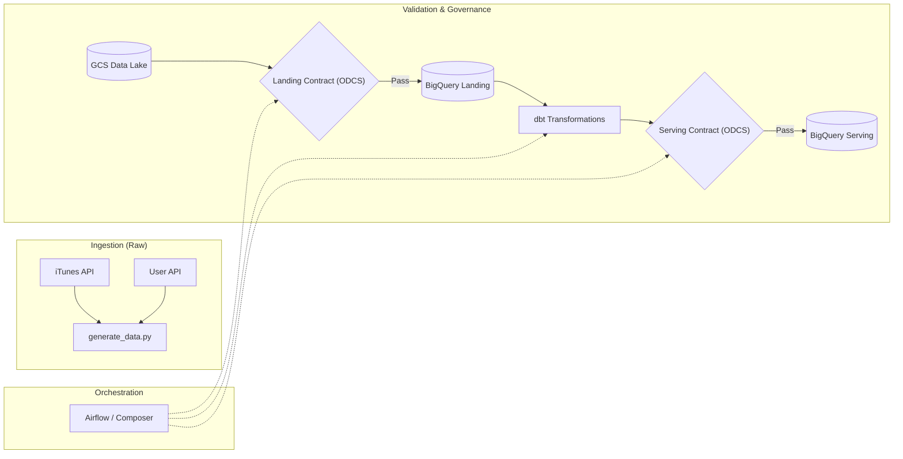
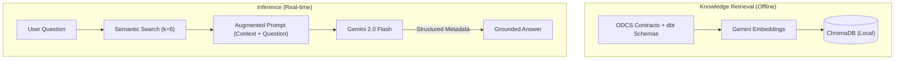

# 🎵 DefTunes: Data Engineering & AI Discoverability Capstone

---

## 📖 The Story: Bridging the "Knowledge Gap"

Every data-driven organization faces a silent bottleneck. It starts with a Slack message:
*   **Data Scientist:** *"Hey, which table has the raw user country code? I need it for this uplift model."*
*   **Business Analyst:** *"What are the quality rules for 'fact_feedback'? I'm seeing weird skips in the dashboard."*
*   **Product Manager:** *"Who owns the songs metadata SLA? I need to know if we can promise 99.9% freshness."*

The answers **do** exist, hidden in ODCS contracts and dbt schemas. But for the **BA and Data Science communities**, the frictionless access to this metadata is the difference between a same-day decision and a week-long research ticket. When discovery is instant, decisions are not just faster — they are **accurate**.

**DefTunes AI** is a RAG assistant designed for this exact purpose. It turns documentation into a conversation, delivering sub-2s answers to the people who need them most.

---

## 🏗️ How It Works

### 1. Unified Data Pipeline
Data moves from the iTunes and User APIs through a governed pipeline where validation is baked into every step.

### 2. AI Discovery Engine
We use semantic search to ensure the model responds only with verified facts.

---

## 📈 Unit Economics — Directional Benchmarking

As a Product Manager, I've modelled the **potential** efficiency gains. While these figures are directional, they highlight the shift from manual search to AI-assisted discovery.

### London Market Assumptions

| Parameter | Value | Rationale |
| :--- | :--- | :--- |
| **Engineer Avg Salary (London)** | **£85,000** | City of London benchmark for Data roles |
| **Blended Rate (inc. Benefits)** | **£65 / hour** | Total employer cost (Pension, NI, overheads) |
| **Estimated Search Saving** | **45-65%** | Industry average for RAG-assisted internal search |
| **AI Query Cost** | **$0.0003** | Based on ~2,100 tokens per query |

### Per-Query Comparison (Theoretical Max)

| Scenario | Cost per query | 1,000 queries/month |
| :--- | ---: | ---: |
| **Manual** (15 min lookup) | £16.25 (~$20.80) | £16,250 |
| **DefTunes AI** (RAG) | $0.0003 | $0.30 |
| **Efficiency Opportunity** | **High** | **Significant Velocity Gain** |

---

## 🧠 Scalability & Real-World Nuances

One might ask: *"If the knowledge base scales to 22,000 chunks, what breaks?"*

**1. Scalability of Cost**
RAG decouples data size from LLM cost. By only retrieving **k=5** chunks, the LLM token count remains stable, keeping the query cost at **~$0.0003** regardless of library size.

**2. Pragmatic Nuances & Caveats**
*   **Retrieval Noise:** At 22,000 chunks, simple vector search becomes noisier. Accuracy isn't "perfect"; it requires a **Human-in-the-loop** for final verification.
*   **Maintenance Overhead:** The ROI must be weighed against the cost of maintaining the embedding pipeline and monitoring for model drift.
*   **Retrieval Depth:** To scale effectively, we would implement **Reranking** or **Small-to-Big** retrieval to ensure the right 5 chunks are found in a massive index.

### 🔗 Industry Reference
For further reading on how enterprise teams are using RAG to handle regulatory and contract-based data, see the **[Microsoft/KPMG Case Study](https://news.microsoft.com/source/features/ai/kpmg-complyai-lawyers-regulatory-compliance-ai/)** on streamlining information retrieval.

---

## 🚀 Performance Metrics

| Metric | Benchmark | PM Insight |
| :--- | :--- | :--- |
| **Token Efficiency** | ~2.1k tokens | Optimized via `k=5` search. |
| **Unit Cost** | **$0.0003 / query** | Fixed cost regardless of repository size. |
| **Latency** | **< 2.0s** | Sub-2s response for "snappy" discovery. |
| **Accuracy** | **Context-Grounded** | Strictly limited to provided contract data. |

---

## 👤 Author: Gourav Chugh
**AI/Data Product Manager**  
[GitHub Portfolio](https://github.com/Chugh-Gourav)

---
*Built for the AI Product Management Capstone — DefTunes Project.*
