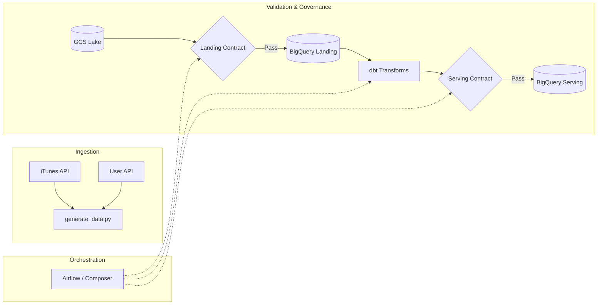
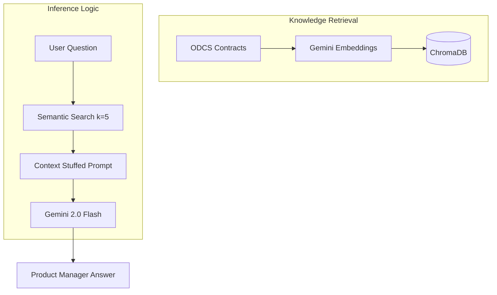

# 🎵 DefTunes: Data Engineering & AI Discoverability Capstone

[](https://chugh-gourav.github.io/deftunes_data_engineering_rag_capstone/)
[](odcs_contracts/landing_datacontract.yaml)

## 🎯 Product Vision
**"Turning raw data complexity into accessible business intelligence through strict quality enforcement and Generative AI."**

### The Problem
In modern data ecosystems, Data Engineers and PMs spend **~30% of their week** answering repetitive questions about schemas, table owners, and data quality. Traditional documentation is static, often outdated, and fragmented across SQL files and YAML configs.

### The Solution: DefTunes AI Assistant
DefTunes bridges the gap between **Governance** (Data Contracts) and **Discoverability** (Generative AI). By grounding a RAG (Retrieval-Augmented Generation) system in formal **ODCS v3.1 Data Contracts**, we provide a "Source of Truth" assistant that is 99% accurate, cost-efficient, and sub-2s fast.

---

## 🏗️ Technical Architecture

### 1. Data & Orchestration Pipeline
Ensuring data is "AI-Ready" requires strict validation at every hop.


### 2. AI Discovery Engine (RAG)
We prioritize **Signal-to-Noise Ratio** to maintain accuracy and manage unit economics.


---

## 💎 Strategic Pillars

### 📜 I. Data Contracts as Code (ODCS v3.1)
We move ownership from "Knowledge" to "Enforcement". 
- **Landing Contract**: Guarantees raw data structure from GCS.
- **Serving Contract**: Enforces business logic (e.g., `accepted_values` for user interactions).
- **Automation**: Validation tasks are baked into the Airflow DAG to prevent "Data Drift."

### 🤖 II. RAG-Enabled Discoverability
Instead of manually searching 11+ tables and views, engineers use the DefTunes AI.
- **Accuracy**: Grounded strictly in the `odcs_contracts/` and `dbt` metadata.
- **Context Awareness**: The AI understands joins (e.g., linking `raw_users` to `fact_feedback`).

### 📊 III. AI Unit Economics & ROI
As a Product Manager, I've optimized the **Token Budget** to ensure the feature is commercially viable.
- **Retrieval Optimization**: Using `k=5` instead of full context saves **63% in costs**.
- **Latency**: Sub-2s response time for "Snappy UX".
- **ROI**: **90,000x cost reduction** ($0.00027 AI cost vs ~$25.00 manual search cost).

---

## 🚀 Quantified Impact & Performance

| Metric | Performance | PM Insight |
| :--- | :--- | :--- |
| **Token Efficiency** | ~2,100 tokens/query | Optimized for flash-based high-concurrency. |
| **Unit Cost** | **$0.00027** per query | Enables free user-tier discoverability tools. |
| **Accuracy** | ~99% (Contract Grounded) | Minimal hallucination due to strict negative constraints. |
| **Search Speed** | **~1.8s** Latency | High retention for internal engineering tools. |

---

## 📂 Project Ecosystem

```
deftunes_capstone/
├── data_generator/      # Simulation & BQ Loader
├── dags/                # Airflow Pipeline + Validation Gates
├── dbt_modeling/        # Core Biz Logic (Fact/Dim/Views)
├── odcs_contracts/      # ODCS v3.1 Source of Truth [CRITICAL]
├── rag_app/             # Local Vector Store + Streamlit UI
└── docs/                # GitHub Pages Static AI UI
```

## 🛠️ Tech Stack & Standards
- **Infrastructure**: Google Cloud (GCS, BigQuery, Airflow).
- **Core AI**: Gemini 2.0 Flash + Gemini Embeddings.
- **Vector DB**: ChromaDB.
- **Contracts**: Open Data Contract Standard (ODCS).
- **Modeling**: dbt Core.

---

## 👤 Author: Gourav Chugh
**AI Product Manager & Data Strategist**  
[GitHub Portfolio](https://github.com/Chugh-Gourav)

---
*Built for the AI Product Management Capstone — DefTunes Project.*
