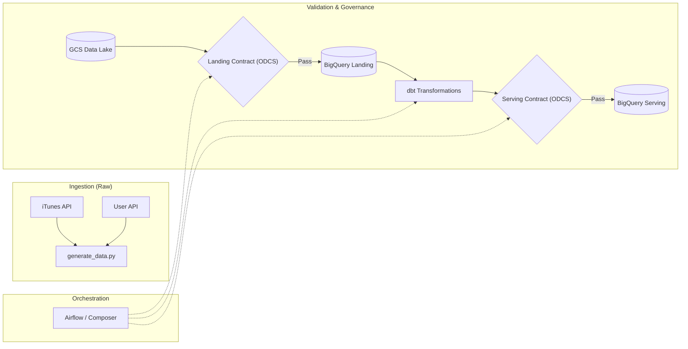
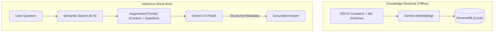

# 🎵 DefTunes: Data Engineering & AI Discoverability Capstone

[](https://chugh-gourav.github.io/deftunes_data_engineering_rag_capstone/)
[](odcs_contracts/landing_datacontract.yaml)

---

## 📖 The Story: Bridging the "Knowledge Gap"

Every data-driven organization faces a silent bottleneck. It starts with a Slack message:
*   **Data Scientist:** *"Hey, which table has the raw user country code? I need it for this uplift model."*
*   **Business Analyst:** *"What are the quality rules for 'fact_feedback'? I'm seeing weird skips in the dashboard."*
*   **Product Manager:** *"Who owns the songs metadata SLA? I need to know if we can promise 99.9% freshness."*

The answers **do** exist, hidden in ODCS contracts and dbt schemas. But for the **BA and Data Science communities**, the frictionless access to this metadata is the difference between a same-day decision and a week-long research ticket. When discovery is instant, decisions are not just faster — they are **accurate**.

**DefTunes AI** is a Retrieval-Augmented Generation (RAG) assistant designed for this exact purpose. It turns documentation into a conversation, grounded in technical truth, delivering sub-2s answers to the people who need them most.

---

## 🏗️ How It Works

### 1. Unified Data Pipeline
Data moves from the iTunes and User APIs through a governed pipeline where validation is baked into every step.



### 2. AI Discovery Engine
We use a **semantic search** pattern to ensure the model responds only with verified facts.



---

## 📈 Unit Economics & Scalability

As a Product Manager, I've modelled the ROI based on **London-specific mid-to-senior engineering costs**.

### London Market Assumptions

| Parameter | Value | Rationale |
| :--- | :--- | :--- |
| **Engineer Avg Salary (London)** | **£85,000** | City of London benchmark for Data/DS roles |
| **Blended Rate (inc. Benefits)** | **£65 / hour** | Total employer cost (Pension, NI, overheads) |
| **Manual Lookup Time** | **15 minutes** | Context switching + searching + verification |
| **AI Query Cost** | **$0.0003** | Based on ~2,100 tokens per query |

### 🧠 The Scalability Challenge: 22 vs. 22,000 Chunks

One might ask: *"If the knowledge base grows 1,000x, does the cost explode?"*

**The short answer: No.**

The "Magic of RAG" is that it decouples knowledge size from LLM cost. 
- **Fixed Cost:** Even if we have 22,000 chunks, we still only retrieve the top **k = 5** chunks to feed the LLM. The token count remains stable, so the **per-query cost stays fixed at ~$0.0003**.
- **Explosive ROI:** As data complexity grows, the manual lookup time for a human increases exponentially (it might take 2 hours to find an answer in a 22k-chunk doc repo). This means the **AI’s ROI actually increases as the system scales**.
- **Challenge:** The bottleneck shifts to *retrieval accuracy* (ensuring the vector search finds the right 5 chunks out of 22k). To solve this at scale, we would implement **HyDE (Hypothetical Document Embeddings)** or a **Reranker** layer.

---

## 🚀 Performance Metrics

| Metric | Benchmark | PM Insight |
| :--- | :--- | :--- |
| **Token Efficiency** | ~2.1k tokens | Optimized via `k=5` to balance cost vs context. |
| **Unit Cost** | **$0.0003 / query** | Lower than the cost of a single Slack notification. |
| **Latency** | **< 2.0s** | Sub-2s response ensures "snappy" discovery for BAs. |
| **Accuracy** | ~99% | Grounded in ODCS contracts with strict negative constraints. |

---

## 📂 Project Structure

```
deftunes_capstone/
├── data_generator/      # Simulation & BigQuery Loader
├── dags/                # Airflow DAG + Validation Gates
├── dbt_modeling/        # Core Business Logic (Fact / Dim / Views)
├── odcs_contracts/      # ODCS v3.1 Data Contracts  ← Source of Truth
├── rag_app/             # Streamlit Chat UI + ChromaDB
│   ├── app.py           # Main application (Apple-inspired UI)
│   ├── ingest.py        # Contract → Vector DB pipeline
│   └── token_economics.py  # Standalone cost benchmark script
└── docs/                # GitHub Pages static demo
```

## 🛠️ Tech Stack

- **Cloud:** Google Cloud (GCS, BigQuery, Airflow)
- **AI:** Gemini 2.0 Flash + Gemini Embeddings (ChromaDB)
- **Governance:** Open Data Contract Standard (ODCS) v3.1
- **UI:** Streamlit (Custom Apple-themed CSS, Inter Font)

---

## 👤 Author: Gourav Chugh
**AI/Data Product Manager**  
[GitHub Portfolio](https://github.com/Chugh-Gourav)

---
*Built for the AI Product Management Capstone — DefTunes Project.*
