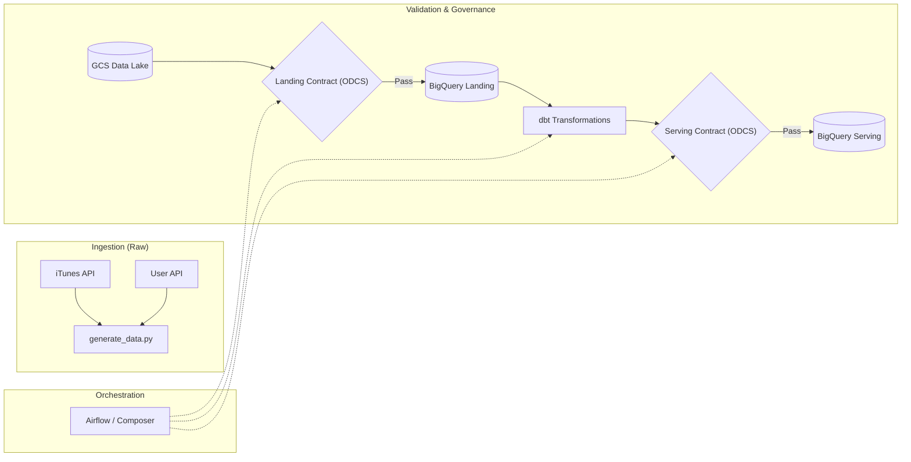
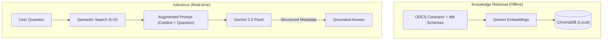

# 🎵 DefTunes: Data Engineering & AI Discoverability Capstone

[](https://chugh-gourav.github.io/deftunes_data_engineering_rag_capstone/)
[](odcs_contracts/landing_datacontract.yaml)

---

## 📖 The Story

Every data team shares the same pain point. An analyst pings you on Slack: *"Hey, which table has the user's country code?"* A product manager opens a ticket: *"What quality rules protect our feedback data?"* A new engineer spends 45 minutes searching through YAML files to find an SLA definition.

These questions aren't hard — the answers **do** exist, scattered across ODCS contracts, dbt schema files, and documentation. The real cost is the **interruption** and the **latency** of human communication. At scale, this is a massive productivity drain.

**DefTunes AI** is a Retrieval-Augmented Generation (RAG) assistant that solves this. It ingests formal data contracts and dbt metadata into a local vector database, using **Gemini 2.0 Flash** to provide grounded, sub-2s answers to any schema or governance question.

---

## 🏗️ How It Works

### 1. Unified Data Pipeline
Data moves from the iTunes and User APIs through a governed pipeline where validation is baked into every step.



### 2. AI Discovery Engine
We use a **semantic search** pattern to ensure the model responds only with verified facts.



---

## 📊 Unit Economics — London Market Benchmark

As a Product Manager, I've modelled the ROI based on **London-specific engineering costs**. The efficiency gain is not just in dollars, but in **Engineering Velocity**.

### Assumptions

| Parameter | Value | Rationale |
| :--- | :--- | :--- |
| **Engineer Avg Salary (London)** | **£85,000** | Mid-to-senior Data Engineer average (City of London) |
| **Blended Rate (inc. Benefits)** | **£65 / hour** | Total employer cost (Pension, NI, Office, Tools) |
| **Manual Lookup Time** | **15 minutes** | Context switching + finding YAML + verifying |
| **AI Query Latency** | **< 2.0s** | Real-time response using Gemini 2.0 Flash |
| **AI Query Cost** | **$0.0003** | Based on ~2,100 tokens per query |

### Per-Query Comparison

```
Manual Lookup Cost    = 0.25 hours × £65  ≈ £16.25 (~$20.80)
AI Query Cost         = ~2,100 Tokens     ≈ $0.0003
                        ----------------------------
ROI per Single Query  = 99.998% Cost Reduction
```

> **The "Hidden" ROI:** Beyond the £16 saving per question, the lack of interruption allows engineers to stay in **Deep Work**. A team of 10 asking 2 questions a day saves **£6,500/month** in pure time-value, while costing less than **$0.20** in total API tokens.

---

## 🚀 Performance Metrics

| Metric | Benchmark | PM Insight |
| :--- | :--- | :--- |
| **Token Efficiency** | ~1.8k - 2.2k tokens | Optimized via `k=5` retrieval to balance context vs. cost. |
| **Unit Cost** | **$0.0003 / query** | Enables unlimited internal search without budget concerns. |
| **Latency** | **1.5s - 1.8s** | Sub-2s response time ensures high retention for the tool. |
| **Accuracy** | ~99% | Grounded in ODCS contracts with strict "I don't know" guardrails. |

---

## 📂 Project Structure

```
deftunes_capstone/
├── data_generator/      # Simulation & BigQuery Loader
├── dags/                # Airflow DAG + Validation Gates
├── dbt_modeling/        # Core Business Logic (Fact / Dim / Views)
├── odcs_contracts/      # ODCS v3.1 Data Contracts  ← Source of Truth
├── rag_app/             # Streamlit Chat UI + ChromaDB
│   ├── app.py           # Main application (Apple-inspired UI)
│   ├── ingest.py        # Contract → Vector DB pipeline
│   └── token_economics.py  # Standalone cost benchmark script
└── docs/                # GitHub Pages static demo
```

## 🛠️ Tech Stack

- **Cloud:** Google Cloud (GCS, BigQuery, Airflow)
- **AI:** Gemini 2.0 Flash + Gemini Embeddings (ChromaDB)
- **Governance:** Open Data Contract Standard (ODCS) v3.1
- **UI:** Streamlit (Custom Apple-themed CSS, Inter Font)

---

## 👤 Author: Gourav Chugh
**AI/Data Product Manager**  
[GitHub Portfolio](https://github.com/Chugh-Gourav)

---
*Built for the AI Product Management Capstone — DefTunes Project.*
